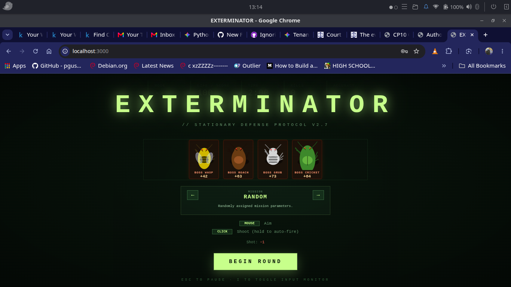

# 🐛 Bugs Of Orion: Authoritative Multiplayer Shooter

**Bugs Of Orion** is a high-performance, real-time multiplayer top-down shooter built on a strict **Authoritative Server** architecture.

The project demonstrates decoupled system design, pairing a multithreaded, headless Python game engine with a lightweight, framework-free HTML5 Canvas frontend.



## 🧠 Architectural Highlights

Rather than relying on heavy game engines or bloated JSON payloads, Bugs Of Orion is engineered from the ground up for maximum performance and low latency.

* **Authoritative Python Backend:** A headless, tick-based game loop running on an asynchronous event loop. It maintains the absolute truth of the game state, handles collision math, and safely processes high-frequency inputs using thread-safe queues.

* **Custom Binary Protocol:** Real-time state synchronization is handled via WebSockets using highly optimized, struct-packed binary payloads. A single 64KB buffer can efficiently pack and broadcast the state of over 4,500 active entities at 60 FPS without crashing the browser.

* **Pure HTML5/JS Frontend:** The client acts as a lightweight rendering terminal. It utilizes the Canvas API's transformation matrix to draw procedural graphics dynamically, avoiding the heavy network load of transferring image assets.

* **Persistent SQLite State:** Player progression, lifetime statistics, and match histories are seamlessly persisted using Python's native `sqlite3` library.

## 🛠️ Tech Stack

**Server / Backend**

* **Language:** Python 3.12+

* **Networking:** `websockets`, `asyncio`

* **Data Packing:** Python `struct` (Binary Serialization)

* **Database:** SQLite3

**Client / Frontend**

* **Language:** Vanilla JavaScript (ES6+)

* **Rendering:** HTML5 `<canvas>` (2D Context)

* **Networking:** Native Browser WebSocket API

## 🚀 Getting Started

### Prerequisites

* Python 3.12 or higher

* A modern web browser

### 1. Start the Server

Clone the repository and spin up the Python backend.

```bash
git clone [https://github.com/vissertom1985/bug-of-orion.git](https://github.com/vissertom1985/bug-of-orion.git)
cd bugfx/server

# Create and activate a virtual environment
python -m venv .venv
source .venv/bin/activate  # On Windows use: .venv\Scripts\activate

# Install dependencies
pip install -r requirements.txt

# Ignite the game loop
python main.py
```

*The server will automatically generate the `buggame.db` SQLite database and bind to port `8080`.*

### 2. Launch the Client

Because the backend strictly communicates over the WebSocket protocol, the HTML frontend must be served over standard HTTP on a separate port.

You can use VS Code's "Live Server" extension, or Python's built-in HTTP server:

```bash
cd ../client
python -m http.server 3000
```

Open `http://localhost:3000` in your web browser to connect to the game!

## ⚙️ Developer Tooling & Automation

This repository includes a custom CI/CD-inspired build script located in `tools/notebook_builder.py`.

Running this script automatically parses the entire Python backend and generates two distinct deployment artifacts:

1. **`BugFX_Server_Builder.ipynb`:** A Jupyter Notebook utilizing `%%writefile` magic commands, allowing the entire server architecture to be deployed and executed in a single click in cloud environments (like Google Colab).

2. **`BugFX_Knowledge_Base.md`:** A compressed, semantically bounded markdown archive of the codebase, optimized for ingestion by RAG pipelines and AI Coding Assistants for rapid debugging and feature expansion.

## 📜 License

This project is licensed under the MIT License - see the [LICENSE](LICENSE) file for details.
